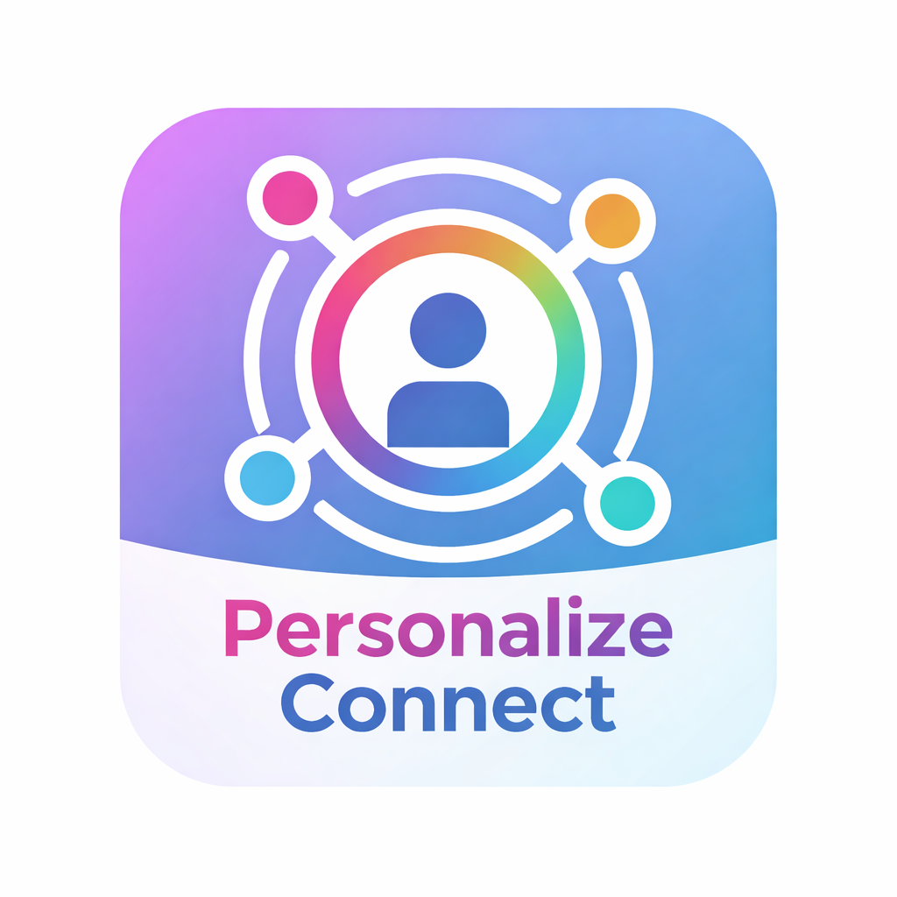
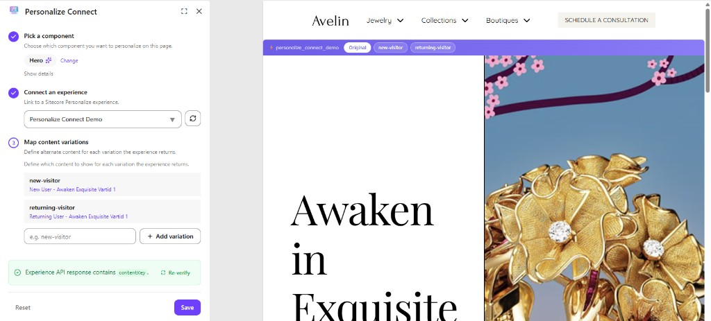
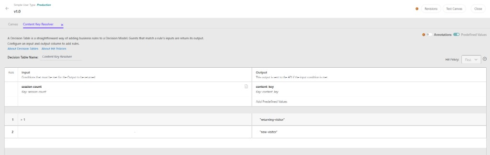

## Team name

⟹ **Team Solo**<br />
⟹ **App Name:** Personalize Connect

## Category

⟹ Best Marketplace App for Sitecore AI

## Description

**Personalize Connect** — A zero-code bridge between SitecoreAI components and Sitecore Personalize Full Stack Interactive Experiences.

- **Module Purpose:** Enable content editors to wire up Personalize decisioning to SitecoreAI components directly from the Page Builder — no developer required. The Marketplace app lets editors select a component, link it to a Personalize Interactive Experience, map content keys to datasources, and publish. The SDK handles runtime decisioning and content swapping automatically.
- **Why not Web Experiences?** Sitecore Personalize Web Experiences can personalize content, but they inject HTML via client-side JavaScript — causing visible flicker on page load and creating content governance problems. Content lives in Personalize rather than in SitecoreAI, so editors lose the structured authoring, workflow, and publishing controls they depend on. Web Experiences also bypass the component model entirely, making it difficult to maintain brand consistency and audit what's being shown.
- **What problem was solved:** Personalize Connect solves this by keeping content where it belongs — in SitecoreAI as structured datasources — while using the full power of Personalize Full Stack Interactive Experiences for 1:1 decisioning. The result is a cohesive flow: Personalize decides *who sees what*, SitecoreAI owns *the content they see*, and the Marketplace app wires them together with zero code. No flicker, no governance gaps, no content sprawl across systems.
- **How this module solves it:** Separates concerns cleanly: SitecoreAI owns content, Personalize owns decisioning, and the Marketplace app provides point-and-click wiring. The SDK reads config from the content tree, calls `POST /v2/callFlows` via the Edge proxy, resolves the returned `contentKey` to the correct datasource, fetches content via GraphQL, and re-renders the component. No per-component code or deployments for new experiences.

For detailed architecture, API contract, and SDK design, see [docs/PERSONALIZE_CONNECT.md](docs/PERSONALIZE_CONNECT.md).

## Video link

⟹ [Team Solo - Sitecore Connect Video](https://youtu.be/5MMyAoPtXH0)

## Pre-requisites and Dependencies

- **SitecoreAI**
- **Sitecore Personalize** tenant with Full Stack Interactive Experiences
- **Personalize API credentials** (API Key and Secret) — configured in the Marketplace app via Settings / ConnectWizard and stored in the Sitecore content tree; no environment variables required
- **Install SDK package in the rendering host** — Follow the [SDK README](packages/sdk/README.md)
- **Node.js 20+** and **pnpm** for the monorepo

## Installation instructions

1. Clone the repository and install dependencies:

   ```bash
   git clone <repo-url>
   cd 2026-Team-Solo
   pnpm install
   ```

2. Build all packages:

   ```bash
   pnpm run build
   ```

3. **SDK:** Add to your SitecoreAI rendering host (Next.js JSS or Content SDK app):

   ```bash
   pnpm add personalize-connect-sdk
   ```

   Or from the local package:

   ```bash
   pnpm add file:../packages/sdk
   ```

4. Wrap your app with `PersonalizeProvider` and components with `withPersonalizeConnect` (see Usage).

Want to try it in your own org? The repo is public — create your own custom app in App Studio and run it locally. See [docs/beta-access.md](docs/beta-access.md) for step-by-step instructions.

### Configuration

**Personalize credentials** are configured in the Marketplace app, not via environment variables. Use the Connect flow (first-time setup) or the Settings page to enter your Personalize API Key, Secret, and Region. Credentials are stored securely in the Sitecore content tree at `{sitePath}/Settings/PersonalizeConnect/Credentials`.

**Rendering host (SDK):** In SitecoreAI, the SDK uses the Edge proxy — pass `sitecoreEdgeContextId` and `siteName` to `PersonalizeProvider`. No Personalize API credentials are needed in the rendering host; the Edge proxy handles calls server-side using credentials stored in Sitecore.

## Usage instructions

### 1. Open the Marketplace app in Page Builder

In SitecoreAI Pages, open the Personalize Connect app from the sidebar. It lists components on the current page. Use the footer to access **Settings** (configure Personalize API credentials) and **Docs** (marketer-facing usage guide).



### 2. Select a component and link an experience

1. **Connect credentials** (first time): Use the Connect flow to enter your Personalize API Key, Secret, and Region. Use **Settings** in the footer to view or update credentials later.
2. Select the component to personalize (e.g., Promo Card).
3. Choose a Full Stack Interactive Experience from the dropdown (fetched from Personalize).
4. Define content keys and map each to an SitecoreAI datasource (e.g., `"new-visitor"` → Welcome Offer, `"returning-visitor"` → Loyalty Deal).
5. Set the default key (used on initial load and as fallback).
6. Save. Configuration is stored in the content tree and published with the page.

### 3. Configure a Personalize Interactive Experience

Create a **Full Stack Interactive Experience** in Sitecore Personalize with a **single variant** that outputs the content keys you defined in the Marketplace app. The experience must return JSON in this shape:

```json
{ "contentKey": "<string>" }
```

**How you decide which content key to return is up to you** — Decision Model, Decision Table, audience conditions, programmable logic, or anything else Personalize supports. The SDK only checks that the response contains a `contentKey` matching one of your mapped keys.

#### Creating the content key in Personalize

The API response must include a top-level `contentKey` property. Key naming in your Decision Model (snake_case, PascalCase, etc.) doesn't matter — your FreeMarker template maps whatever you output into that property.

**Decision Table example**

1. Add a **Decision Model** to your experience.
2. Add a **Decision Table** (e.g., "Content Key Resolver") with:
   - **Input column:** a condition (e.g., `session count` with key `session_count`)
   - **Output column:** a string output (e.g., key `content_key` — naming is up to you)
3. Add rules that map inputs to output values, e.g.:
   - `session_count > 1` → `"returning-visitor"`
   - (default/catch-all) → `"new-visitor"`
4. Use **Predefined Values** on the output to ensure you return exact strings that match the content keys you defined in the Marketplace app.



#### Experience API response template

In the experience variant's **API Response** tab, use FreeMarker to read the Decision Model output. The template below reads the first Decision Table's output and returns it as `contentKey` (adjust the field name to match your Decision Table output):

```freemarker
<#if (decisionModelResults)?? && (decisionModelResults.decisionModelResultNodes)??>
<#list decisionModelResults.decisionModelResultNodes as result>
<#if result.type == "decisionTable" && (result.outputs)?? && (result.outputs?size > 0)>
{
  "contentKey": "${result.outputs[0].content_key}"
}
</#if>
</#list>
<#else>
{
  "contentKey": "default"
}
</#if>
```

With the Decision Table above, this returns `{ "contentKey": "returning-visitor" }`, `{ "contentKey": "new-visitor" }`, or falls back to `{ "contentKey": "default" }` if the Decision Model has no results.

#### Custom data in responses

> **Coming soon.** Currently the SDK only reads `contentKey` from the experience response. Support for returning custom data alongside the content key (e.g., rendering parameters, promotional metadata) is planned for a future release.

For more details on the architecture and API contract, see [docs/PERSONALIZE_CONNECT.md](docs/PERSONALIZE_CONNECT.md).

### 5. Integrate the SDK in your rendering host

```tsx
// app/layout.tsx or _app.tsx
import { PersonalizeProvider } from "personalize-connect-sdk";

export default function RootLayout({ children }) {
  return (
    <PersonalizeProvider
      sitecoreEdgeContextId={process.env.SITECORE_EDGE_CONTEXT_ID}
      siteName={process.env.SITECORE_SITE_NAME}
    >
      {children}
    </PersonalizeProvider>
  );
}
```

The SDK uses the SitecoreAI Edge proxy for Personalize calls and datasource resolution. Personalize credentials are configured in the Marketplace app and stored in Sitecore — no API keys needed in the rendering host.

```tsx
// components/PromoCard.tsx
import { withPersonalizeConnect } from "personalize-connect-sdk";

const PromoCard = ({ fields }) => (
  <div>
    <h2>{fields.title.value}</h2>
    <p>{fields.body.value}</p>
  </div>
);

export default withPersonalizeConnect(PromoCard);
```

The HOC looks up config from the content tree (loaded by the provider on mount), renders with the default datasource first, calls the experience asynchronously, and re-renders with personalized content when the response returns.

### Project structure

| Package                                      | Description                                               |
| -------------------------------------------- | --------------------------------------------------------- |
| [packages/marketplace](packages/marketplace) | Page Builder context panel (Next.js app)                  |
| [packages/sdk](packages/sdk)                 | Runtime SDK (PersonalizeProvider, withPersonalizeConnect) |

### Quick start (local dev)

```bash
pnpm install
pnpm run build
pnpm run dev   # Starts marketplace app on :5555
```

## Comments

Personalize Connect targets the hackathon scope: one component per page, client-side content swap, and anonymous browserId. The architecture is designed to support future enhancements (SSG pre-rendering, multiple components, CDP identity, edge-side decisioning) without rearchitecting the core.
